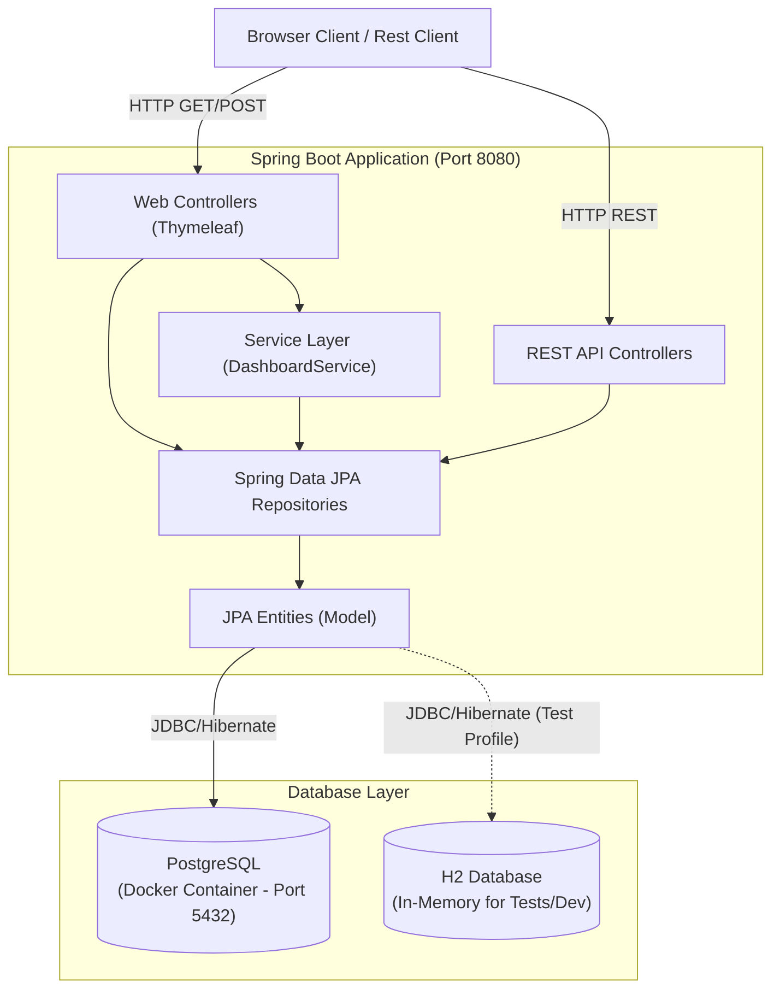

# System Architecture Diagram

```mermaid
flowchart TD
    Client["Browser Client / Rest Client"]

    subgraph SpringBoot["Spring Boot Application (Port 8080)"]
        UI["Web Controllers (Thymeleaf)"]
        API["REST API Controllers"]
        
        Service["Service Layer (DashboardService)"]
        
        Repo["Spring Data JPA Repositories"]
        
        Entities["JPA Entities (Model)"]
        
        UI --> Repo
        UI --> Service
        API --> Repo
        Service --> Repo
        Repo --> Entities
    end

    subgraph DatabaseLayer["Database Layer"]
        Postgres[("PostgreSQL\n(Docker Container - Port 5432)")]
        H2[("H2 Database\n(In-Memory for Tests/Dev)")]
    end

    Client -- "HTTP GET/POST" --> UI
    Client -- "HTTP REST" --> API
    
    Entities -- "JDBC/Hibernate" --> Postgres
    Entities -. "JDBC/Hibernate (Test Profile)" .-> H2
```
