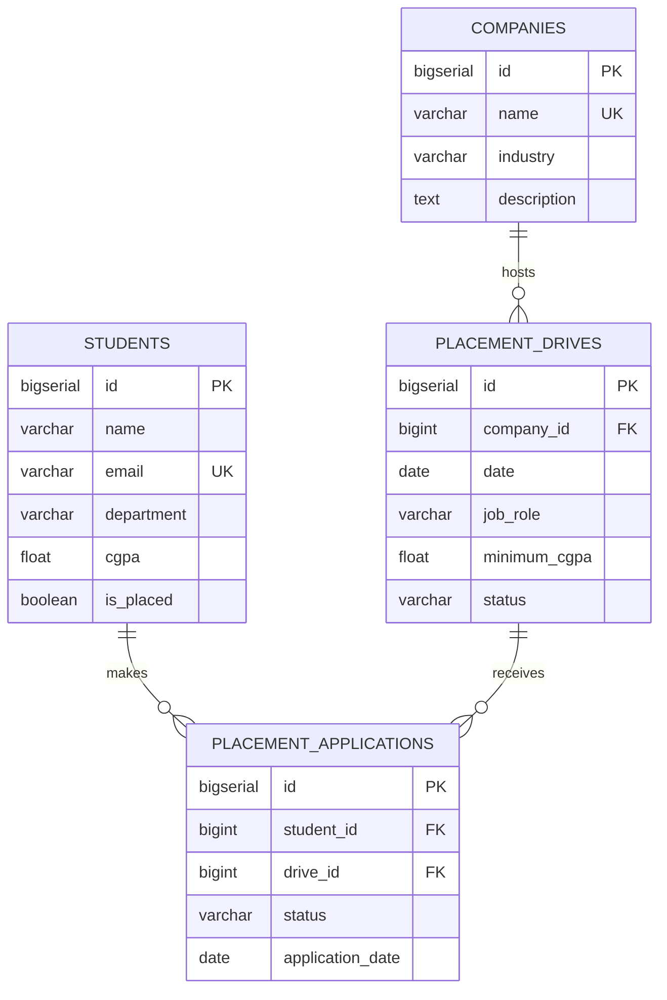

# Database Data Model Diagram

```mermaid
erDiagram
    STUDENTS {
        bigserial id PK
        varchar name
        varchar email UK
        varchar department
        float cgpa
        boolean is_placed
    }

    COMPANIES {
        bigserial id PK
        varchar name UK
        varchar industry
        text description
    }

    PLACEMENT_DRIVES {
        bigserial id PK
        bigint company_id FK
        date date
        varchar job_role
        float minimum_cgpa
        varchar status
    }

    PLACEMENT_APPLICATIONS {
        bigserial id PK
        bigint student_id FK
        bigint drive_id FK
        varchar status
        date application_date
    }

    COMPANIES ||--o{ PLACEMENT_DRIVES : "hosts"
    STUDENTS ||--o{ PLACEMENT_APPLICATIONS : "makes"
    PLACEMENT_DRIVES ||--o{ PLACEMENT_APPLICATIONS : "receives"
```
