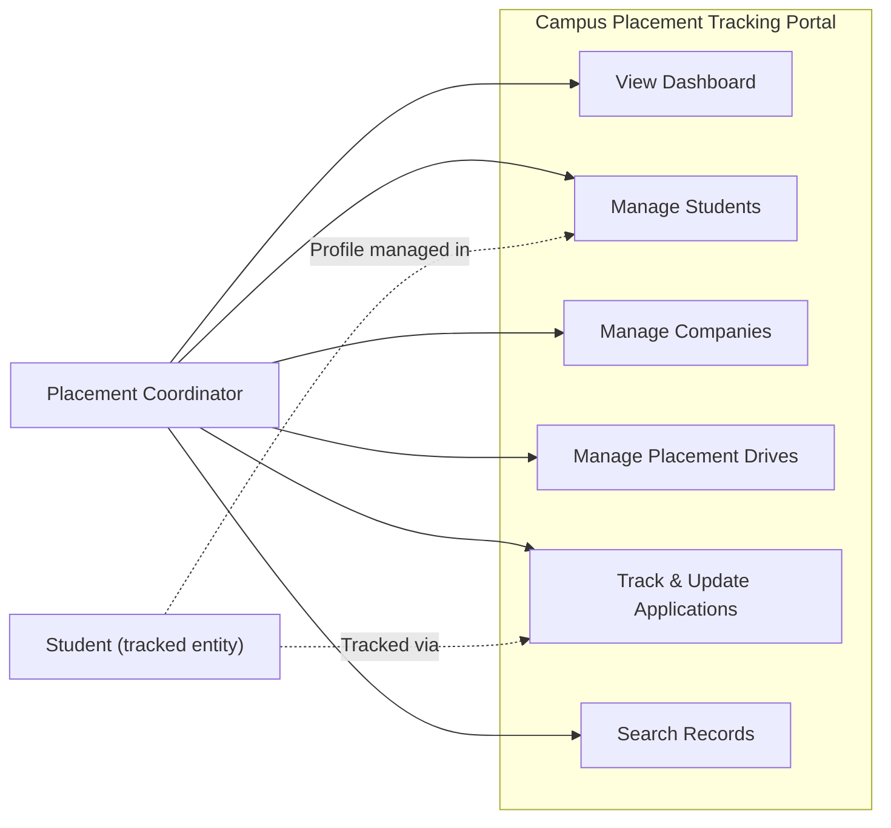

# Use-Case Diagram

```mermaid
flowchart LR
    Admin["Placement Coordinator"]
    Student["Student (tracked entity)"]

    subgraph Portal["Campus Placement Tracking Portal"]
        UC1["View Dashboard"]
        UC2["Manage Students"]
        UC3["Manage Companies"]
        UC4["Manage Placement Drives"]
        UC5["Track & Update Applications"]
        UC6["Search Records"]
    end

    Admin --> UC1
    Admin --> UC2
    Admin --> UC3
    Admin --> UC4
    Admin --> UC5
    Admin --> UC6

    Student -.->|"Tracked via"| UC5
    Student -.->|"Profile managed in"| UC2
```
